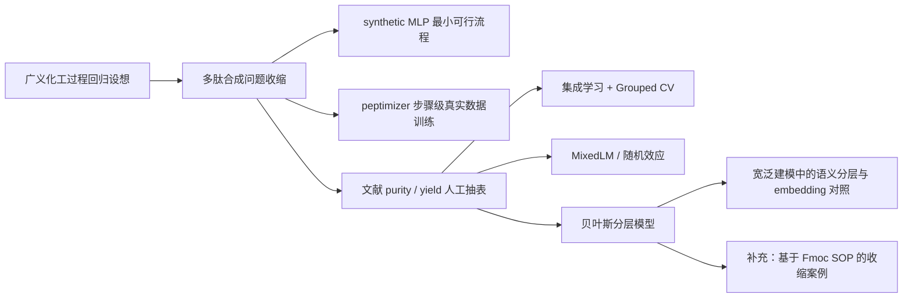
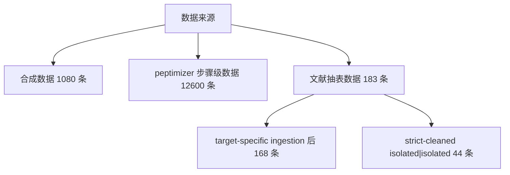
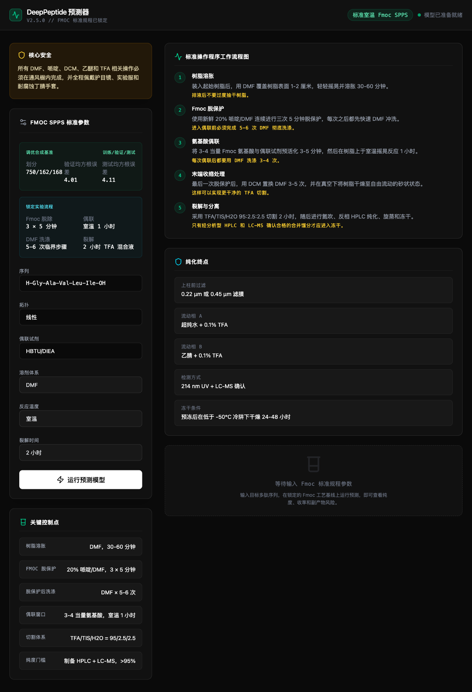
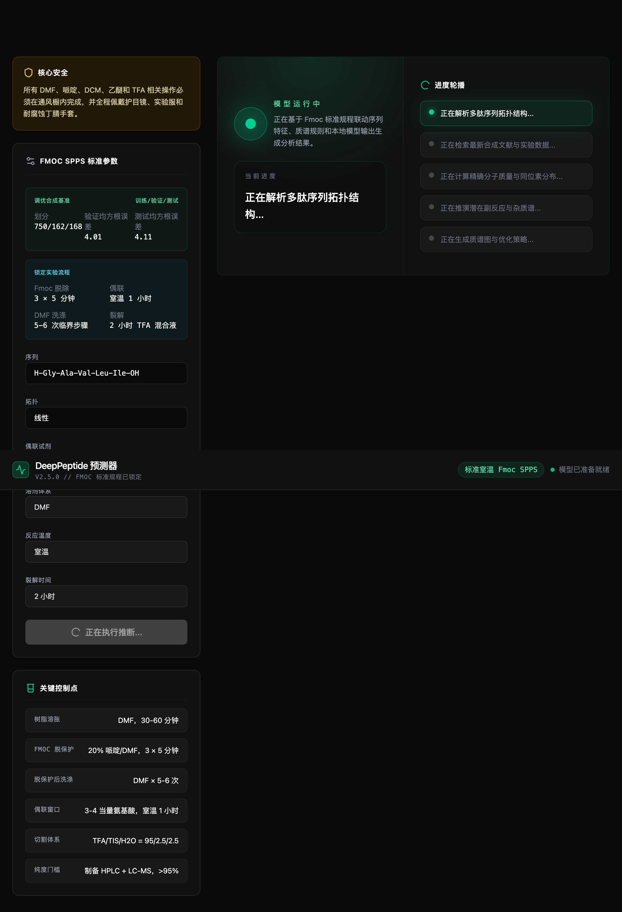
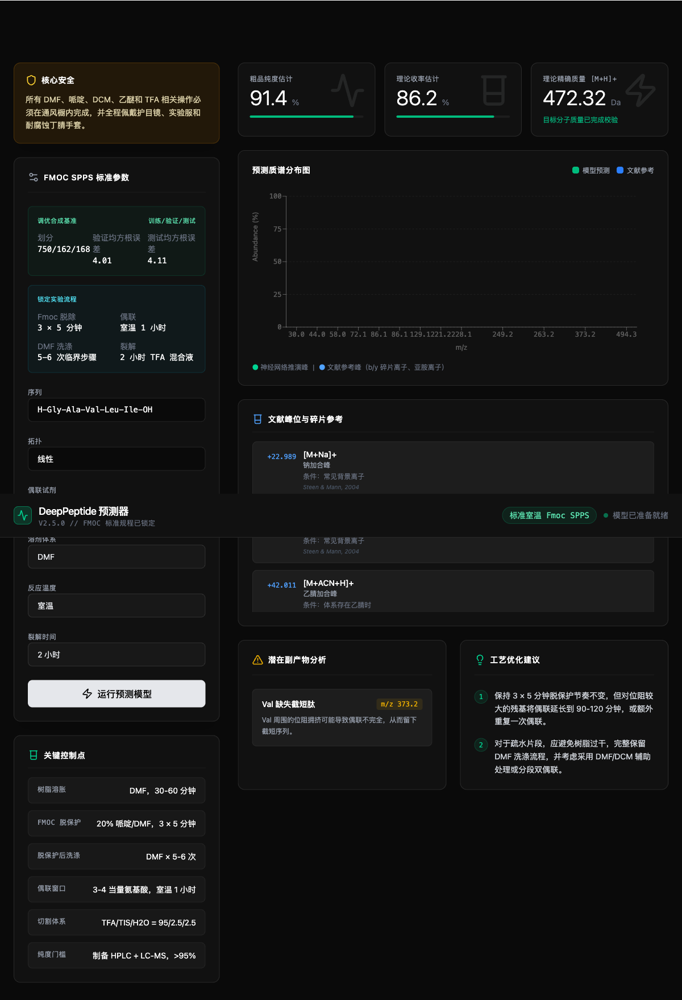

# 多肽合成机器学习学习报告

**副标题：** 从泛化化工过程回归到多肽合成宽泛建模与分层异质性分析  
**作者：** 待填写  
**日期：** 2026-03-03  
**关键词：** 多肽合成；机器学习；Fmoc SPPS；分层模型；过程优化

## 摘要

本报告围绕“机器学习能否用于多肽合成过程中的质量预测与实验决策辅助”这一问题，系统整理了一个本科阶段交叉研究项目的形成、推进、受阻与收敛过程。项目最初受 AlphaFold 与大模型浪潮启发，试图从更一般的化工实验回归问题切入，即通过实验参数与结果数据之间的映射关系，拟合出可用于优化产率与纯度的模型。随着探索推进，变量间强耦合、实验噪声大、标签语义不统一以及公开可得高质量数据稀缺等问题逐步显现，使得“大而泛”的化工建模路线难以继续。进入链肽与环肽合成实验环境后，研究对象逐渐聚焦到多肽合成领域，并沿着“宽泛文献建模 + 分层控制异质性”的主线继续推进。报告依次介绍了合成数据 MLP 基线、MIT `peptimizer` 真实步骤级数据训练、文献人工抽表数据集构建、集成学习工作流、预训练蛋白 embedding 对照、研究层随机效应分析以及贝叶斯分层模型。结果表明：公开可得且带序列信息的 `final purity / isolated yield` 数据极其稀缺；跨文献来源的异质性与标签语义差异显著强于统一序列规律；将 `source_id` 与标签语义变量显式纳入分析是必要的，否则会高估可迁移性；ESM2 embedding 在宽泛文献任务上并未自动提升整体性能，但在收缩的 `Fmoc SOP` 补充子集中能够带来正向增益。因此，当前更合理的研究收敛方向并非构建跨体系通用预测器，也不是完全退回单一 SOP 优化，而是继续以宽泛建模为主，同时坚持分层控制异质性，并把更贴近实验的收缩任务作为补充案例。[1-8,17]

## 1 研究背景与意义

### 1.1 AI 浪潮与研究动机

2024 年诺贝尔化学奖授予与蛋白质结构预测和蛋白质设计相关的研究工作，进一步强化了 AI for Science 在化学、生物与材料研究中的代表性地位。AlphaFold 所展示的，不只是单一模型精度的提升，更是“高质量数据、合理表示学习与明确科学任务”三者协同后的突破性成果。与此同时，自 2023 年以来生成式大模型快速普及，使得机器学习不再只是少数算法研究者的工具，而成为化学、材料、药物等学科学生可以主动接触和尝试的方法学资源。[1-3]

本项目的起点正是在这样的背景下形成。最初的设想并未限定在多肽合成，而是更一般地提出一个化工过程回归问题：如果化工实验中存在大量条件参数与结果数据，是否可以通过机器学习拟合出高产率、高纯度对应的最优参数区域。该设想具有明显的工程吸引力，因为化工实验往往伴随较高的时间成本、试剂成本与试错代价，一旦能从历史实验中提取规律，就有可能提高实验效率并减少无效尝试。

### 1.2 化工过程优化中的机器学习潜力

机器学习在化学反应预测中的典型价值，主要体现为三类任务：其一是反应结果分类与产物预测；其二是对产率、选择性、纯度等连续变量进行回归；其三是通过主动学习、贝叶斯优化或强化学习辅助实验设计。已有研究表明，机器学习可以对复杂反应体系中难以直接解析的非线性关系进行拟合，并在一定条件下为实验者提供比经验启发更系统的优化建议。[4]

然而，化工过程并不是天然适合被简单地表示为“输入条件到输出指标”的干净监督学习任务。许多实验变量之间存在物理化学耦合关系，同一变量在不同体系中的意义可能并不相同；噪声既可能来源于测量误差，也可能来源于实验体系本身的波动；而不同论文或实验室的数据记录格式、标签定义和质量控制标准也常常不统一。因此，机器学习在化工问题中的价值，不仅取决于模型本身，更依赖于任务边界是否清晰、数据语义是否统一以及实验体系是否具有足够稳定的共同结构。

### 1.3 从泛化化工建模转向多肽合成问题的原因

项目早期之所以推进缓慢，主要有四个现实原因。第一，不同影响因素之间相互关联，难以直接构建归一化的一一映射关系。第二，化工实际应用中存在大量数据噪声，数据清洗与人工标注负担远高于最初预期。第三，化工领域分支众多，不同子领域的实验逻辑和理论约束差异显著，很难在早期就建立统一模型。第四，在研究起步阶段，化工专业知识储备尚有限，研究问题过大导致难以有效落地。

后续研究之所以能够继续推进，一个关键转折点是进入链肽与环肽合成的实际实验场景。相比于更泛化的化工过程，多肽合成至少具备三个更适合建模的特点：一是序列天然提供了离散、可编码的结构输入；二是工艺流程相对规范，可以围绕偶联、脱保护、切割、纯化等固定步骤展开；三是部分公开文献与 MIT `peptimizer` 项目提供了可以利用的真实数据入口。由此，项目从“广义化工过程回归”收缩为“多肽合成质量预测与过程解释”。

### 1.4 本项目的理论意义与实践意义

从理论上看，本项目的价值不在于宣称已经构建了一个强泛化的多肽合成预测器，而在于通过一条真实的探索路径，展示了化学实验建模中任务定义、数据工程、模型选择与研究边界收缩之间的关系。项目结果表明，模型性能不佳并不一定意味着算法失败，更可能意味着问题设定或数据组织方式尚未与科学任务对齐。

从实践上看，本项目完成了三项可持续利用的工作。其一，建立了一个前端可演示、训练可复现的最小化多肽质量预测流程。其二，接入了 MIT `peptimizer` 真实公开数据，形成了步骤级代理信号的标准训练管线。其三，围绕文献中的 `final purity / isolated yield` 数据构建了带来源追踪的手工抽表数据集，并进一步发展出集成学习、标签语义分层、随机效应分析与贝叶斯分层分析流程。这些工作共同为后续在宽泛文献任务中继续提升方法严谨性，以及在补充性的实验 SOP 子任务中做更细化验证，打下了基础。

## 2 文献综述

### 2.1 AlphaFold 与 AI for Science 的启发

AlphaFold2 在蛋白质结构预测任务上的突破，是近年来 AI for Science 最具代表性的案例之一。其意义不只是深度学习模型替代传统结构求解流程，而是说明在任务边界清晰、评价标准明确、训练数据规模充足时，机器学习可以对复杂生物化学系统建立高度有效的映射。诺贝尔化学奖 2024 对相关工作的认可，也强化了这一认识。[1-3] 对本项目而言，这类工作提供的最重要启示并不是“任何化学问题都可以直接套用神经网络”，而是必须先找到一个具有稳定标签定义与共同实验语境的问题。

### 2.2 机器学习在化学反应预测与优化中的一般进展

在更广泛的化学机器学习研究中，反应结果预测、收率预测与实验条件优化已经形成相对成熟的研究方向。早期工作多依赖分子指纹、模板匹配和浅层模型，而后逐渐发展到图神经网络、序列模型以及结合自动化实验平台的数据驱动优化。Schwaller 等人的工作表明，反应数据的表示方式与任务定义会显著影响预测质量；同一算法在不同数据语义下可能表现完全不同。[4] 这一点对本项目尤其关键，因为多肽合成中的“产率”“纯度”“粗品”“终产物”“回收率”等标签并不天然等价。

### 2.3 多肽合成过程中的机器学习研究现状

与一般有机反应相比，多肽合成具有更强的序列结构特征，也更容易受到相邻氨基酸相互作用、局部聚集、位阻效应和保护基体系影响。近年来，多肽合成机器学习研究主要分为两类：一类关注流程级信号预测，例如 fast-flow peptide synthesis 中步骤级的监测信号；另一类关注结果级预测，例如环肽闭环成功率、合成结果优先级或可合成性评分。[5-7] 这类研究表明，序列长度本身并不足以决定难度，残基相邻关系、局部疏水连续性、位阻与带电分布等特征更可能决定真实的合成风险。

### 2.4 fast-flow peptide synthesis 与 step-level proxy 学习

MIT 团队发表的 `Deep learning enabled prediction and optimization of fast-flow peptide synthesis` 是本项目最重要的直接参考之一。该研究基于 fast-flow peptide synthesis 平台记录的步骤级实验信号，构建了对脱保护和聚集代理指标进行预测的深度学习模型，并进一步服务于合成路径优化。[5] 其配套公开仓库 `peptimizer` 提供了 12,600 条真实实验步骤记录，为本项目接入高质量公开数据提供了可行起点。[16]

但这一方向的局限同样十分明确：其预测目标是 `first_area`、`first_height`、`first_width`、`first_diff` 等步骤级代理信号，而非最终 `final purity / isolated yield`。因此，该数据集非常适合训练“合成过程风险感知模型”，却不能被直接表述为最终粗品纯度或终产物收率预测器。本项目后续关于任务边界的反复澄清，很大程度上源于这一差异。

### 2.5 环肽闭环结果预测与 cyclopeptide 优化平台

另一条与本项目高度相关的研究线索是面向环肽闭环结果与治疗性环肽优化的平台研究。`CycloPepper: a machine learning platform for predicting cyclization outcomes and optimizing synthesis of therapeutic cyclopeptides` 提供了一个较为接近“实验决策辅助平台”的范式：其目标并非泛化到所有多肽化学，而是围绕环肽闭环这一明确子任务，结合数据与平台设计，为实验者提供更可执行的判断依据。[7] 这一思路对本项目的影响在于，它提示研究不必从一开始就追求“大一统预测器”，而可以先围绕明确实验子场景建立可解释、可用的局部模型。

### 2.6 当前研究空白：真实 purity / isolated yield 数据稀缺与异质性问题

本项目在联网搜索和文献人工抽表过程中发现，真正与界面目标直接匹配的公开数据，即同时具有明确序列信息、明确 `purity` / `yield` 指标、且可用于监督学习的文献条目，数量极其有限。相比之下，步骤级代理信号数据更易获得。现有可用 `final purity / isolated yield` 数据往往分散在单篇论文的表格或补充材料中，每篇仅提供 2 到 20 条左右样本，并且经常混合不同树脂、不同保护策略、不同反应模式和不同纯化口径。[8-15]

因此，当前领域真正的研究空白并不在于是否还能设计出更复杂的神经网络，而在于如何在数据稀缺与标签异质条件下，合理界定任务目标、构建结构化数据集并控制研究来源偏差。本项目之所以最终引入随机效应与贝叶斯分层模型，根本原因正是这里的数据现实。

## 3 问题定义与研究路线演进

### 3.1 初始目标：用实验参数拟合 purity / yield

项目的最初目标相对直接，即从实验中可记录的条件变量出发，构建对 `Crude Purity`、`Predicted Yield`、目标分子验证情况和模拟质谱信息的统一预测框架。进入多肽合成领域后，最先被关注的条件变量包括 `Topology`、`Coupling Reagent`、`Solvent System`、`Reaction Temp`、`Cleavage Time` 等。这一阶段的设想，是将这些实验参数与最终实验结果建立对应关系，并在网页端给出可视化输出。

### 3.2 早期停滞原因

这一思路很快遭遇三类困难。第一，参数之间并非独立，例如某些偶联试剂与溶剂体系总是共同出现，某些高难度序列天然伴随更强偶联条件。第二，真实实验结果中存在大量测量噪声、记录不完整与标签语义不统一的问题。第三，公开可得数据量远不足以支撑直接训练复杂模型。结果是，单纯从“实验条件表格”出发并不能自然得到一个稳健的监督学习任务。

### 3.3 加入导师项目后的问题重构

加入链肽与环肽合成课题后，研究问题开始重构。与其试图对所有化工实验建立通用回归器，不如围绕一个具体实验语境收缩任务：固定到多肽合成，再进一步锁定到 Fmoc 固相合成流程，并将建模重点放到“序列难度”“局部聚集风险”“可能导致纯度下降或收率偏低的因素”上。此时，项目中的模型不再只是为了输出一个数字，而是需要能够解释为什么某类序列在这套工艺下更难合成。

### 3.4 从“大而泛”到“多肽合成领域内聚焦”

研究路线随后分化为三条并行但相关的技术线。第一条是合成数据 MLP，用于建立前端演示所需的最小可行流程。第二条是接入 `peptimizer` 真实步骤级数据，训练过程风险代理模型。第三条是从公开文献中人工抽取 `purity` / `yield` 数据，尝试逼近真正的结果级任务。这三条线分别对应“可交互系统”“高质量真实公开数据”和“真实研究问题”。

### 3.5 从统一预测器到分层建模与补充 SOP 案例

当文献抽表数据逐步积累后，一个重要发现是，不同论文体系之间的差异远强于统一序列规律。也就是说，假如忽略来源差异直接训练统一模型，很容易把研究来源本身的系统偏差误认为是序列规律。于是，项目方法开始从“统一预测器”转向“显式建模来源差异”，先后引入 grouped CV、随机效应分析与贝叶斯分层模型。后续虽然也围绕实验室的标准 Fmoc SPPS 流程做了一个更贴近本地实验的补充子任务，但该子任务不再被视为研究主线，而是作为一个对照案例，用来说明在化学空间被收缩时，模型表现和解释逻辑会发生怎样的变化。

**图 1** 研究路线演进图。

## 4 数据来源与数据工程

### 4.1 MIT peptimizer 数据集

本项目接入的第一类高质量真实公开数据，是 MIT `learningmatter-mit/peptimizer` 仓库中的快流多肽合成数据。该数据集包含 12,600 条步骤级记录，预测目标为 `first_area`、`first_height`、`first_width`、`first_diff`，更接近去保护和聚集相关代理信号。其优点是样本量大、数据结构规范、公开可复现；其局限是目标并非最终粗品纯度或终产物收率。[5,16]

在项目实现中，为减少信息泄漏，训练、验证和测试集不是按行随机切分，而是按合成序列编号 `serial` 做 grouped split。最终划分为 `8907 / 1791 / 1902`，对应 `538 / 115 / 116` 个唯一 `serial` 分组。

### 4.2 文献人工抽表数据集

第二类数据来源是围绕 `final purity / isolated yield` 目标的文献人工抽表数据集。项目通过联网检索和逐篇整理，建立了 `data/real/final_purity_yield_literature.csv`，并以 `source_id` 标记研究来源。该数据集当前共整理 `183` 条来源可追踪记录，覆盖 `16` 个 primary sources，其中新增了 `parallel_pec_2021` 这类以 `purified_hplc + recovery` 为主的纯化文献条目，也补齐了 `Human Beta Defensin 3` 的 canonical sequence 与 `isolated` basis 映射。若按当前 target-specific ingestion 进入建模流程，则共有 `168` 条样本至少包含一个有效目标值。[8-15]

### 4.3 数据字段定义

文献数据集并非单一实验表，而是由不同论文中的表格、正文和补充信息整理而成，因此字段设计需要兼顾化学意义与建模可用性。当前建模使用的核心字段可分为四类：

- 序列与组成特征：`sequence`、`length`、`avg_hydrophobicity`、`total_charge`、`molecular_weight`、`avg_volume`
- 组成比例特征：`unique_ratio`、`hydrophobic_ratio`、`bulky_ratio`、`polar_ratio`、`charged_ratio`、`aromatic_ratio`、`sulfur_ratio`
- 局部风险特征：`max_coupling_difficulty`、`longest_hydrophobic_run_norm`、`n_term_basic`、`c_term_acidic`
- 上下文变量：`topology`、`purity_stage`、`yield_stage`、`yield_basis_class`、`coupling_reagent`、`solvent`

### 4.4 数据清洗流程

为了让文献数据尽可能可用于监督学习，项目实现了一套完整的数据工程流程，步骤包括：标签解析、精确重复检测、基于序列相似度的近重复去除、异常值识别、缺失值处理、标准化/归一化、模型式特征选择以及最终的分组交叉验证。这一流程被统一实现于 `python/comprehensive_ml_workflow.py`，并通过 `artifacts/comprehensive-ml-workflow-report.json` 输出阶段性结果。

### 4.5 异常值剔除、重复去除、近重复去除

在当前文献数据子集中，经过 sequence normalization 与标签解析后，可直接进入 `comprehensive_ml_workflow` 的初始样本为 `168` 条；其中 purity 有效标签 `139` 条，yield 有效标签 `168` 条，二者同时存在的样本为 `139` 条。最新清洗结果显示，精确重复删除 `1` 条，基于序列相似度的近重复删除 `4` 条，source-aware 异常值过滤删除 `8` 条，最终保留 `155` 条进入严格语义建模。与更早版本相比，本轮清洗不再使用全局长度/分子量 z-score 直接裁剪文献样本，而改为更保守的 `source_id + stage` 局部 IQR 规则，并要求近重复样本同时具备相同实验上下文，避免把同序列不同 resin / folding 路径错误合并。

### 4.6 缺失值处理、标准化与归一化

缺失值处理默认采用 `mean imputation`，理由是当前文献数据量小、来源异质性强，在按 `source_id` 进行 grouped CV 时，KNN 邻域结构不稳定，容易把局部来源分布误当作可靠近邻。对于具有连续量纲、分布近似可中心化的变量，如 `length`、`molecular_weight`、`avg_hydrophobicity` 等，采用标准化处理；对于天然位于比例或占比语义空间中的变量，如 `hydrophobic_ratio`、`bulky_ratio`、`charged_ratio`、`longest_hydrophobic_run_norm` 等，则采用 `[0, 1]` 归一化。这样做的目的，是保留比例特征的边界语义，同时避免连续变量在集成模型前的尺度偏置。

### 4.7 训练、验证、测试划分方式与理由

不同任务采用了不同的切分策略。合成数据 MLP 采用标准的 `750 / 162 / 168` 训练、验证、测试切分；`peptimizer` 真实数据按 `serial` grouped split；文献数据集则不设置固定测试集，而是采用 `GroupKFold` 与 leave-one-source-out 评估。这种设计反映了三类任务的不同性质：合成数据是受控模拟任务，真实步骤级数据关注防止序列泄漏，而文献抽表任务的最大风险来自研究来源之间的系统差异，因此必须显式按来源分组。

### 4.8 数据局限性分析

当前数据工程的最核心结论不是“样本仍不够大”这么简单，而是三重约束同时存在。第一，`final purity / isolated yield` 数据本身稀缺。第二，不同来源的标签口径并不统一，`crude`、`purified`、`final product`、`recovery` 等指标不可直接混同。第三，不同论文所采用的树脂、试剂、保护策略、流动合成模式和纯化口径差异巨大。由此可见，模型难题并不仅是参数优化问题，更是任务可定义性问题。

**图 2** 数据来源分层图。

## 5 特征工程与建模设计

### 5.1 输入变量与实验参数来源

项目中使用的输入变量可以分为两类。一类直接来自实验或文献记录，如 `Topology`、`Coupling Reagent`、`Solvent System`、`Reaction Temp`、`Cleavage Time`、`purity_stage` 等；另一类由序列经过规则计算得到，例如疏水比例、含硫比例、局部疏水连续长度、位阻困难氨基酸比例等。前者用于刻画工艺上下文，后者用于刻画序列内在难度。

### 5.2 序列特征构造逻辑

序列特征的设计遵循一个核心判断：序列长度本身不应被视为唯一难度指标，相邻残基关系与局部聚集风险更为关键。基于这一认识，项目采用了包括 `hydrophobic_ratio`、`bulky_ratio`、`charged_ratio`、`max_coupling_difficulty` 和 `longest_hydrophobic_run_norm` 在内的一组结构化特征。这一设计与 fast-flow peptide synthesis 相关研究强调“局部序列上下文比单一长度更重要”的结论相呼应。[5]

### 5.3 16 维 synthetic_ui_model 特征说明

前端 `synthetic_ui_model` 使用的 16 维输入特征为：

1. 序列长度归一化  
2. 大位阻氨基酸比例  
3. 难偶联氨基酸比例  
4. 疏水残基比例  
5. 带电残基比例  
6. breaker 残基比例  
7. 含硫残基比例  
8. 天冬酰亚胺风险  
9. 缩合试剂评分  
10. 拓扑复杂度  
11. 温度评分  
12. 溶剂评分  
13. 裂解条件评分  
14. 序列复杂度  
15. 最长疏水连续片段  
16. 半胱氨酸环化适配度  

这些特征的目标不是重建真实化学全部复杂性，而是为前端提供一套可重复、可解释、可训练的最小特征集。

在项目后续推进中，又额外引入了一类来自预训练蛋白语言模型的表征特征。具体做法是使用 ESM2 家族模型对标准化后的氨基酸序列做 mean pooling，先得到原始序列 embedding，再在每个分组交叉验证训练折内单独做 PCA 降维，将少量主成分与上述手工特征拼接进入回归模型。这一设计并不是为了让 embedding 取代化学特征，而是为了补充那些难以由少量手工统计量表达的高阶序列上下文信息。[17-19]

这里所说的 ESM2 embedding 有明确的外部来源，而不是项目内部重新预训练得到。具体而言，本项目调用的是 Hugging Face 上 AI at Meta 发布的公开 checkpoint `facebook/esm2_t6_8M_UR50D`；根据其 model card，这一 checkpoint 属于 ESM-2 系列中的 6 层、8M 参数模型。进一步根据 Meta 官方 `esm` 仓库中的预训练模型表，该 checkpoint 对应的预训练语料为 `UR50/D 2021_04`，单条序列经最后一层表征池化后得到 `320` 维 embedding。项目代码中通过 `transformers` 加载该 checkpoint，读取最后一层 `last_hidden_state`，去除特殊 token 后做 mean pooling，因此报告中的 embedding 数据来源，实质上是 Meta 公开发布、以 `UR50/D 2021_04` 蛋白序列语料预训练得到的 ESM2 模型输出。[18,19]

### 5.4 MLP 结构设计依据

合成数据模型采用小型前馈神经网络 `MLP`。其参数配置如表 1 所示。

| 参数 | 配置 |
| --- | --- |
| 模型类型 | 小型前馈神经网络 / MLP |
| 输入特征数 | 16 |
| 隐藏层数 | 1 |
| hidden size | 8 |
| 激活函数 | `tanh` |
| 输出维度 | 2（purity, yield） |
| 学习率 | 0.12 |
| L2 正则 | 0.0015 |
| max epochs | 420 |
| patience | 55 |
| 训练数据规模 | 1080 |
| 场景数 | 6 |
| 划分 | 750 / 162 / 168 |
| validation combined RMSE | 4.0063 |
| test combined RMSE | 4.1082 |

之所以选择 MLP 而不是更复杂的序列模型，是因为这一阶段的任务主要是建立最小可行流程，并用有限特征验证从输入到 purity / yield 的端到端训练是否可复现。对于只有 16 维特征的任务，过于复杂的模型反而更容易把合成数据中的启发式结构过拟合为表面性能。

### 5.5 真实数据模型：GRU / CNN / hybrid 搜索

在 `peptimizer` 路线上，项目对 `gru`、`cnn`、`hybrid` 三种架构进行了比较。最终最优结构为 `gru_residual_small`，关键参数如下：

| 参数 | 配置 |
| --- | --- |
| architecture | `gru` |
| name | `gru_residual_small` |
| max length | 40 |
| embedding dim | 16 |
| sequence hidden | 32 |
| numeric hidden | 32 |
| trunk hidden | 96 |
| dropout | 0.12 |
| split strategy | grouped-by-`serial` |
| train / val / test | 8907 / 1791 / 1902 |

模型由 pre-chain token embedding、双向 GRU 编码器、下一步氨基酸与偶联剂 embedding、数值特征分支以及 residual MLP trunk 组成。其设计重点在于将序列上下文与工艺数值特征共同编码，而不是仅把下一步氨基酸作为独立分类变量。该模型最终用于预测步骤级代理信号，而非最终 purity / yield。

### 5.6 集成学习工作流设计

为应对文献数据集的小样本与异质性问题，项目在 `python/comprehensive_ml_workflow.py` 中实现了一个结构化集成学习工作流。其关键设置如下：

- 预处理流程：标签解析、异常值识别、去重、特征工程、缺失值处理、标准化/归一化
- 缺失值策略：`mean imputation`
- 特征选择：`SelectFromModel(ExtraTreesRegressor)`
- 集成模型：`VotingRegressor`
- 基学习器：`RandomForestRegressor`、`ExtraTreesRegressor`、`GradientBoostingRegressor`、`Ridge`
- 交叉验证：`GroupKFold`
- 调参方式：`RandomizedSearchCV`

这一工作流的核心意图不是追求模型“新颖性”，而是以较稳健的传统集成框架，系统比较预处理各阶段对性能的影响，并输出特征重要性分析结果。

### 5.7 研究分层与随机效应建模

当文献数据扩展到 135 条、`sequence + isolated yield` 子集扩展到 29 条后，项目开始引入研究分层思路。原因在于，不同 `source_id` 对产率和纯度的影响远大于统一序列规律。如果忽略研究来源，把所有样本视为同分布数据，将高估模型可迁移性。基于此，项目在 meta 风格分析中引入随机效应 pooled mean、`I^2`、`tau^2` 和 `ICC` 等指标，并在回归层面引入带 `source_id` 随机截距的 `MixedLM`。

### 5.8 贝叶斯分层模型的引入原因

进一步的贝叶斯分层模型，则是为了在极小多研究数据集下，比频率学 `MixedLM` 提供更稳定的层级估计与更诚实的不确定性表达。该模型采用 Gibbs 采样，固定效应为序列特征，随机效应为研究层随机截距，输出 posterior mean、95% credible interval、posterior ICC 与研究层随机截距后验分布。其价值不在于给出窄而准的预测区间，而在于明确量化“研究来源效应占主导”的事实。

**表 2** 模型路线对比表。

| 模型路线 | 数据来源 | 预测目标 | 主要结构 | 评估重点 |
| --- | --- | --- | --- | --- |
| synthetic MLP | 合成数据 1080 条 | purity, yield | 16 维输入 + 单隐藏层 MLP | 最小可行流程、前端演示 |
| peptimizer GRU | 真实步骤级数据 12600 条 | `first_area` 等 4 个代理信号 | GRU + residual trunk | 过程风险代理建模 |
| ensemble workflow | 文献数据 120/108 条 | purity, yield | `VotingRegressor` + 特征选择 | 预处理影响、分组 CV |
| MixedLM | `sequence + isolated yield` 29 条 | isolated yield | 随机截距线性混合模型 | 来源效应建模 |
| Bayesian hierarchical | `sequence + isolated yield` 29 条 | isolated yield | 贝叶斯随机截距层级模型 | 不确定性与研究层解释 |

## 6 实验过程与结果分析

### 6.1 合成数据基线训练结果

合成数据基线的主要作用，是建立一个端到端闭环：定义特征、生成样本、划分数据、训练模型、导出权重并接入前端。当前数据集规模为 1080 条，六类场景各 180 条。模型在验证集上的 `combined RMSE` 为 `4.0063`，测试集为 `4.1082`；其中 purity 和 yield 的测试集 `R^2` 分别为 `0.7502` 与 `0.7485`。这些结果说明该 MLP 能够较好拟合项目自定义的合成规则，但这一点只意味着“模型能重建模拟世界中的启发式规律”，并不代表其对真实实验体系具有同等泛化能力。

在后续将输出层训练损失从平方误差切换为 Huber loss 后，合成 MLP 的表现并未改善，反而略有下降：验证集 `combined RMSE` 从 `4.0063` 上升到 `4.0380`，测试集从 `4.1082` 上升到 `4.1100`，对应变化幅度分别约为 `+0.79%` 和 `+0.045%`。这一结果说明，对于当前噪声较低、规则较平滑的合成任务，Huber loss 的鲁棒性优势并没有转化为更好的总体误差，平方误差仍然更适合这类“干净的启发式模拟数据”。

### 6.2 向量化与并行化加速结果

在完成合成模型训练逻辑后，项目进一步将 `python/optimize_model.py` 的训练内核改为 NumPy 矩阵化，并将超参数候选搜索并行化执行。在当前机器上的一次完整运行时间约为 `0.814s`，显著缩短了反复调参的等待成本。与此同时，真实数据训练脚本也补入了 Windows 上的 `CUDA` 路径、`DataLoader` 优化，以及 macOS Apple 芯片环境下的 CPU 线程优化，使得模型实验可以在不同本地环境中更高效地重复执行。

### 6.3 peptimizer 真实数据训练结果

`peptimizer` 路线是本项目中“最扎实的真实公开数据建模”部分。该路线最终筛选出的最优结构为 `gru_residual_small`。由于训练报告导出结构在后续迭代中发生过调整，报告文件不再直接保留顶层 `bestModel` 字段，但模型开发日志与训练脚本一致表明当前最优配置即上述 GRU 小型残差结构。根据既有训练报告，在平方误差训练下，验证集 `combined RMSE` 约为 `0.1732`，测试集约为 `0.1608`。需要再次强调的是，这一结果针对的是步骤级代理信号，而不是最终 purity / yield。

在将真实数据训练的输出层损失切换为 Huber loss 后，项目先采用默认 `delta=1.0` 做了一轮替换，随后又对 `delta={0.5,0.75,1.0,1.25,1.5}` 做了固定架构、固定随机种子的搜索。最终在公平比较条件下，最佳配置为 `gru_residual_small + Huber(delta=0.75)`，其验证集 `combined RMSE` 为 `0.1715`，测试集为 `0.1620`。若与最初的平方误差版本相比，验证集改善约 `0.0017`，约合 `0.96%`；但测试集则略有上升约 `0.0012`，约合 `0.78%`。若只在 Huber 家族内部比较，`delta=0.75` 相比默认 `delta=1.0` 又带来了小幅提升：验证集从 `0.1720` 下降到 `0.1715`，测试集从 `0.1626` 下降到 `0.1620`，幅度分别约为 `0.25%` 和 `0.37%`。

这组结果说明，Huber loss 对真实步骤级数据确实更有鲁棒性，尤其在验证集上能够提供更稳定的收敛；但其收益仍然属于“小幅微调”而非结构性跃升。更准确的表述应当是：在真实公开数据上，Huber loss 比平方误差更适合作为抗异常值的训练损失，而 `delta` 的进一步搜索能够再挤出一小部分性能，但目前还不足以改变任务本身的上限判断。

### 6.4 文献 purity / yield 全量工作流结果

在文献抽表数据子集上，`comprehensive_ml_workflow` 给出了当前最贴近“宽泛多肽文献建模”主线的结果。当前可用样本数为 120 条，经过序列近重复去除与异常值筛除后，进入最终 grouped CV 工作流的样本数为 108 条，覆盖 8 个来源。

在不使用预训练蛋白 embedding 的 baseline tuned ensemble 下，按 `source_id` 分组的严格交叉验证结果为：

- purity RMSE：`20.042`
- purity MAE：`15.391`
- purity `R^2`：`-0.091`
- purity ±5% 容差准确率：`0.204`
- yield RMSE：`36.871`
- yield MAE：`29.541`
- yield `R^2`：`-0.645`
- yield ±10% 容差准确率：`0.259`
- 联合命中率：`0.046`

这组结果与项目此前的判断一致：在全量文献任务中，模型能够吸收到部分信息，但来源异质性与标签语义混合仍然显著压制了整体表现。

### 6.5 全量任务中的 ESM2 embedding 前后对照

在全量工作流上，项目又进一步接入了 ESM2 预训练蛋白语言模型 `facebook/esm2_t6_8M_UR50D`，并把 mean pooling 后的原始序列 embedding 作为附加输入。其来源可以拆成两层理解：方法学层面来自 ESM-2/ESMFold 对应的 Science 论文；工程实现层面，本项目直接调用 Hugging Face 上的公开 checkpoint，而该 checkpoint 在 Meta 官方 `esm` 仓库的预训练模型表中被标注为 `UR50/D 2021_04` 语料、`6` 层、`8M` 参数、`320` 维 embedding。为避免信息泄漏，embedding 不直接以原始高维向量进入模型，而是在每个 grouped CV 训练折内单独做 PCA，将 `320` 维 embedding 压到 `8` 个主成分后，再与手工特征拼接。[17-19]

在这一设置下，embedding 增强后的全量任务结果变为：

- purity RMSE：`21.034`
- purity MAE：`16.407`
- purity `R^2`：`-0.202`
- purity ±5% 容差准确率：`0.185`
- yield RMSE：`37.810`
- yield MAE：`30.146`
- yield `R^2`：`-0.730`
- yield ±10% 容差准确率：`0.287`
- 联合命中率：`0.056`

与 baseline 相比，其变化为：

- purity RMSE delta：`+0.992`
- yield RMSE delta：`+0.939`

也就是说，在当前“宽泛文献任务”上，ESM2 embedding 并没有改善整体 RMSE，反而略微拉低了 purity 与 yield 的总体回归性能。这一结果非常重要，因为它说明预训练蛋白 embedding 并不是对所有异质化学任务都天然有利。对于当前这一混合了多种 purity / yield 口径与研究体系的文献数据集来说，标签语义和研究来源差异仍然强于 embedding 能带来的统一序列表示收益。

### 6.6 标签语义分层评估结果

虽然 embedding 未改善全量任务的总体 RMSE，但分层评估反而把“问题出在哪里”揭示得更清楚。对 embedding 增强后的全量模型按标签语义做拆分后，可以看到：

- purity 按 `purity_stage` 分层时，`purified_hplc` 子集的 RMSE 为 `6.274`，且 ±5% 准确率达到 `0.500`
- `crude_hplc` 子集 RMSE 为 `25.755`
- `final_product` 子集样本数仅 13，RMSE 为 `15.862`，但 `R^2` 极端为负，反映出样本过少且来源偏移显著

yield 侧的分层差异更加明显：

- `crude` yield 子集 RMSE：`37.369`
- `isolated` yield 子集 RMSE：`42.408`
- `recovery` 子集 RMSE：`24.251`

如果进一步按 `yield_basis_class` 拆分，差异会更大：

- `crude` basis RMSE：`56.689`
- `isolated` basis RMSE：`42.408`
- `other` basis RMSE：`20.733`
- `recovery` basis RMSE：`24.251`

这些结果表明，当前宽泛任务中最强的信号之一，并不是纯粹的序列难度，而是“这条记录究竟属于什么标签语义”。这一点也与 permutation importance 的结果一致：在 purity 和 yield 两个目标上，`purity_stage` 都是最重要的变量之一，而加入 embedding 后，`sequence_norm` 本身也成为高重要度特征，但仍不足以压过标签语义与来源差异。

### 6.7 meta 风格分析结果

对 29 条 `sequence + isolated yield` 子集进行 meta 风格分析后，可得到如下结论：

- 研究数：5
- 随机效应 pooled mean isolated yield：`30.53%`
- 95% CI：`13.76%` 到 `47.30%`
- `tau^2`：`353.744`
- `I^2`：`0.986`

`I^2` 接近 1 表明研究间异质性极高，也就是不同论文体系本身的差异远大于统一序列规律。此时若仍然把所有样本视为独立同分布数据，所得结论将明显过于乐观。

### 6.8 贝叶斯分层模型结果

贝叶斯分层模型在 leave-one-study-out 下得到：

- RMSE：`33.070`
- MAE：`30.011`
- `R^2`：`-1.493`
- 95% 区间覆盖率：`0.552`
- 平均区间宽度：`88.945`

相比之下，贝叶斯模型相对 `Ridge` 与 `MixedLM` 在 RMSE 上有所改善，但仍然不足以支持跨研究强泛化主张。更重要的是其后验解释结果：

- posterior ICC 均值：`0.897`
- 95% CI：`0.746` 到 `0.978`

这说明研究来源效应占据主导地位。固定效应中，`length` 和 `max_coupling_difficulty` 后验均值为负，`avg_hydrophobicity` 和 `total_charge` 后验均值为正，但这些系数的 95% 可信区间大多仍跨 0，因此更适合作为方向性线索，而不是确定的稳定规律。

### 6.9 补充：基于 Fmoc SOP 的收缩子集分析

虽然本报告主线回到“宽泛文献建模 + 分层控制异质性”，项目仍保留了一个贴近实验室实际的补充案例：将数据进一步收缩到更接近标准 Fmoc SPPS SOP 的化学空间。筛选规则为：`condition_summary` 中明确包含 `Fmoc`，拓扑为线性或未标注线性，序列可被标准化解析，同时排除 `Boc`、`AFPS`、`stapled`、`sulfotyrosine`、`PEGylation`、`HOPO`、`solvent-less RAM`、`ligation`、`microwave` 等明显偏离当前 SOP 的体系。由此得到一个更贴近当前实验边界的严格子集，共 `66` 条序列可解析记录，来自 `3` 个来源：`amyloid_hydrophobic_2008`、`teabags_fmoc_2021` 和 `trityl_anchor_2013`。

这一补充子集的价值，不在于替代全量工作流，而在于提供一个对照视角：当化学空间被强烈收缩后，yield 任务相对于简单来源均值基线会出现恢复性改善。使用仅含序列特征的 `Ridge` 基线时：

- purity grouped RMSE：`30.781`
- purity mean-baseline RMSE：`30.621`
- yield grouped RMSE：`34.040`
- yield mean-baseline RMSE：`47.106`

进一步加入 ESM2 embedding 后，该子集上的结果又变为：

- purity manual + embedding Ridge RMSE：`29.281`
- yield manual + embedding Ridge RMSE：`30.867`

这说明预训练蛋白 embedding 的收益更像是“在收缩化学空间后的增强项”，而不是能够直接解决宽泛文献任务中的异质性问题。因此，`Fmoc SOP` 子集在本项目中更适合作为补充案例，用来说明“同一种特征工程策略在不同任务边界下会呈现不同效果”。

**表 3** 预处理前后性能对比表（grouped CV）。

| 阶段 | purity RMSE | purity R² | yield RMSE | yield R² | joint accuracy |
| --- | ---: | ---: | ---: | ---: | ---: |
| baseline raw | 17.512 | 0.135 | 37.907 | -0.627 | 0.008 |
| after exact dedup | 17.512 | 0.135 | 37.907 | -0.627 | 0.008 |
| after sequence dedup | 17.427 | 0.142 | 38.149 | -0.649 | 0.008 |
| after outlier removal | 18.332 | 0.087 | 37.590 | -0.710 | 0.083 |
| after imputation & scaling | 18.844 | 0.035 | 37.494 | -0.701 | 0.056 |
| after_feature_selection | 20.125 | -0.100 | 38.781 | -0.820 | 0.037 |
| final_tuned_ensemble | 20.042 | -0.091 | 36.871 | -0.645 | 0.046 |
| final_tuned_ensemble_with_embeddings | 21.034 | -0.202 | 37.810 | -0.730 | 0.056 |

从表 3 可以看出，异常值剔除对 purity 与 yield 有一定帮助；在宽泛任务上，baseline tuned ensemble 仍是总体 RMSE 最好的结果；而 embedding 增强阶段并未带来整体提升，反而提示标签语义异质性仍然是当前任务中的首要瓶颈。

**表 4** 研究层异质性与贝叶斯分层结果摘要。

| 指标 | 数值 |
| --- | ---: |
| sequence + isolated yield 样本数 | 29 |
| 研究来源数 | 5 |
| pooled mean isolated yield | 30.53 |
| I² | 0.986 |
| Grouped Ridge RMSE | 47.218 |
| Grouped MixedLM RMSE | 48.428 |
| Grouped Bayesian RMSE | 33.070 |
| Bayesian posterior ICC | 0.897 |

### 6.10 前端可视化系统与 SOP 模板接入结果

在模型开发之外，项目还完成了一个面向实验使用者的前端系统原型。该系统已改为中文界面，并切换到以标准 Fmoc SPPS SOP 为语境的交互模式。点击“运行预测模型”后，右侧会出现带呼吸灯效果的加载界面，并轮播显示“正在解析多肽序列拓扑结构”“正在检索最新合成文献与实验数据”“正在计算精确分子质量与同位素分布”“正在推演潜在副反应与杂质谱”“正在生成质谱图与优化策略”等进度提示。结果页则以更接近学术分析的中文表述展示粗品纯度估计、理论收率估计、理论精确质量、文献峰位与碎片参考、副产物分析及工艺优化建议。

**图 3** Fmoc SOP 中文首页。

**图 4** 运行预测时的加载界面。

**图 5** 结果页与分析面板。

### 6.11 异质性治理新实验：贝叶斯校准 + 残差学习（LOSO）

针对“跨研究来源系统偏移”问题，本轮在全量文献任务上新增了两阶段路线：先用贝叶斯分层校准器建模 `source_id + stage` 随机效应，再用 `VotingRegressor` 学习残差非线性。评估采用 LOSO（按 `source_id` 留一来源）并与 raw ensemble 做直接对照。对应实现位于 `python/bayesian_multitask_calibrator.py`、`python/residual_ensemble.py` 与更新后的 `python/comprehensive_ml_workflow.py`，结果写入 `artifacts/comprehensive-ml-workflow-report.json`。

在本次正式实验配置（`random_search_iterations=4, draws=300, tune=300, chains=2, embedding_components=8`）下，LOSO 总体结果为：

- Raw ensemble LOSO：purity `R²=-0.059`，yield `R²=-0.180`，joint accuracy `0.080`
- 仅贝叶斯校准：purity `R²=0.131`，yield `R²=-0.204`，joint accuracy `0.044`
- 贝叶斯 + 残差（含 yield 语义多头加权）：purity `R²=0.027`，yield `R²=-0.279`，joint accuracy `0.044`

可见该路线对 purity 的跨来源泛化有一定帮助（`R²` 从负值提升到正值区间），但在 yield 侧仍未达到可用阈值，更未达到“yield LOSO `R² >= 0.55`”目标。按 RMSE 看，final 模型相对 raw 的 purity 有改善（`19.46 -> 18.65`，约 `+4.1%`），但 yield 仍恶化（`33.25 -> 34.62`，约 `-4.1%`）。

针对本轮新增的 yield 多头加权，`yieldHeadAggregation` 显示：只有 `isolated|isolated` 头在大部分折中满足局部建模条件（平均融合权重约 `0.524`），而 `crude|other`、`crude|crude`、`recovery|recovery` 头在 LOSO 训练折中常常缺少足够样本或来源覆盖，导致无法稳定启用局部头模型（`localUsageRate` 接近 0）。这也是 yield 端提升受限的直接原因。

后验异质性分解结果进一步支持“来源效应不可忽略”：

- purity：`ICC_source=0.156`，`ICC_stage=0.175`
- yield：`ICC_source=0.148`，`ICC_stage=0.137`

这说明在当前数据规模与标签噪声条件下，source/stage 的系统偏移仍会吞噬一大部分可迁移序列信号。换言之，“分层控制异质性”是必要条件，但还不是充分条件；要在 yield 上实现稳定增益，仍需继续强化标签语义统一与来源层面的数据工程。当前工作流已切换到 PyMC/NUTS 后端，并在校准器中保留了 `normal` 与 `student_t` 两种观测似然可选。

### 6.12 PyMC 似然对照：normal vs Student-t

为验证“重尾噪声建模是否能提升跨来源泛化”，本轮在相同 LOSO 框架下对 `normal` 与 `student_t` 似然做了并行对照。由于全量多头 + 置换重要性代价较高，该轮采用了快速消融设置（关闭局部 yield 头再校准与残差置换重要性，仅比较似然差异），结果记录在 `artifacts/comparisons/bayes_likelihood_compare.json`，图表输出为 `docs/bayes-likelihood-ablation.md` 与 `docs/images/bayes-likelihood-ablation.png`。

对照结果显示，`student_t` 相比 `normal` 的变化为：

- purity `R²`：`-0.508`（下降）
- yield `R²`：`-0.025`（下降）
- purity RMSE：`+2.803`（变差）
- yield RMSE：`+0.297`（变差）
- joint accuracy：`+0.0177`（小幅上升）

该结果表明，在当前样本规模与分层设定下，`student_t` 尚未带来稳定的点预测收益，反而让 RMSE 与 `R²` 指标整体变差。更合理的结论是：`student_t` 可以作为鲁棒选项保留，但短期不宜默认启用；后续应先把收益重点放在标签语义统一、来源层样本扩充与 stage/basis 路由稳定性上，再重新评估重尾似然的边际价值。

### 6.13 RNN + Attention 架构对照

在真实步骤级任务上，项目新增了 `rnn_attention` 候选架构（`BiGRU + Additive Attention`），并与现有 `gru`、`cnn`、`hybrid` 在同一数据切分与同一训练流程下做并行对照（`Huber delta=1.0`）。该改动实现于 `python/train_real_model.py`，结果写入 `artifacts/real-architecture-comparison.json` 与 `docs/rnn-attention-architecture-comparison.md`。

对照结果为：

- `gru_residual_small`：validation combined RMSE=`0.171968`，test combined RMSE=`0.162649`
- `rnn_attention_residual_medium`：validation combined RMSE=`0.172909`，test combined RMSE=`0.162632`

可见 `rnn_attention` 相对 GRU 在测试集上仅有极小幅度下降（约 `-0.000017`），但在验证集上略有恶化（约 `+0.000941`）。这说明其收益目前不稳定，尚不足以支持替换主架构。结合历史最优（`gru + Huber(delta=0.75)`，validation=`0.171534`，test=`0.162049`），本轮 `rnn_attention` 也未达到新的最好点。

因此，当前更合理策略是：保留 `rnn_attention` 作为候选分支继续跟踪，但主架构仍维持 GRU。是否替换应以 grouped CV 或多随机种子下的“均值提升且方差不恶化”作为前置条件。

### 6.14 grouped CV + 多随机种子稳定性检验（是否优于 GRU）

针对“是否稳定优于 GRU”这一关键判定，项目新增了独立基准脚本 `python/architecture_grouped_cv_benchmark.py`，在同一数据源上执行 `GroupKFold(serial)` 并叠加多随机种子重复训练。实验设置为：架构 `gru` vs `rnn_attention`，`3` 折 grouped CV，`3` 个随机种子（共 `9` 次/架构），`Huber delta=1.0`，每折训练内部再按 serial 分组拆分验证集。结果写入 `artifacts/grouped-cv-architecture-benchmark.json` 与 `docs/grouped-cv-architecture-benchmark.md`。

核心结果如下：

- GRU：test combined RMSE 均值 `0.173258`，标准差 `0.003721`
- RNN+Attention：test combined RMSE 均值 `0.171783`，标准差 `0.004184`
- 相对 GRU 的 test RMSE 均值差：`-0.001475`（均值略优）
- 相对 GRU 的 test RMSE 标准差差：`+0.000463`（方差略差）
- 对应 seed-fold 配对胜率：`0.444`（9 组里仅 4 组优于 GRU）

因此，从“均值 + 方差 + 配对胜率”三重标准看，`rnn_attention` 目前**不构成稳定优于 GRU**。更准确的判断是：它具备潜在增益，但波动更大，尚不足以替换主架构。

### 6.15 RNN+Attention 小网格复测（hidden/dropout/delta）

在 6.14 的基础上，项目继续对 `rnn_attention` 做了小网格调参，并保持同样的 `3 seeds × 3 folds` grouped CV 稳定性评估。网格设置为：

- `hidden={32,40}`
- `dropout={0.12,0.18}`
- `delta={0.75,1.00}`

共计 `8` 组配置、`72` 次训练，结果见 `artifacts/rnn-attention-grid-benchmark.json` 与 `docs/rnn-attention-grid-benchmark.md`。

对照结论如下：

1. 若只看“配对胜率是否达到 0.6”，目标已达成。  
   最佳组合为 `h40/do0.12/d0.75`，对 GRU 的配对胜率达到 `0.778`，test RMSE 均值为 `0.170971`（优于 GRU 的 `0.173258`）。
2. 但该最高胜率组合的 test RMSE 标准差为 `0.004530`，高于 GRU 的 `0.003721`，说明其波动更大。
3. 若采用更严格标准（均值更优 + 方差不劣化 + 胜率≥0.6），可通过的组合为 `h40/do0.18/d1.00`：  
   配对胜率 `0.667`，test RMSE 均值 `0.172445`，标准差 `0.003651`。

这表明 `rnn_attention` 通过小网格后，已经从“没有稳定优势”提升到“存在可替换候选”，但收益幅度仍偏小。更稳妥的后续动作是扩大随机种子数量做二次确认，再决定是否替换主架构。

### 6.16 仅候选最优组合的 5-seed 终审复核

为避免“网格筛选后偶然偏差”，项目进一步只保留候选最优组合 `h40/do0.18/d1.00`，与 GRU 在同一 `5 seeds × 3 folds` 框架下做终审复核。结果如下：

- GRU：test RMSE 均值 `0.173455`，标准差 `0.003233`
- `rnn_attn_h40_do0.18_delta1.00`：test RMSE 均值 `0.172406`，标准差 `0.005069`
- 配对胜率（相同 seed/fold 对照）：`0.600`

这说明该候选在“平均误差”和“胜率”上达到了预设门槛，但方差仍明显高于 GRU。基于“均值提升 + 稳定性不下降”原则，当前结论是：`rnn_attention` 继续保留为候选架构，但暂不正式替换 GRU 主架构。

### 6.17 当日开发与测试更新（2026-03-05）

本日完成了三项面向“是否替换主架构”的工程化推进。第一，在 `python/train_real_model.py` 中新增 `rnn_attention` 分支（`BiGRU + Additive Attention`），并把该分支纳入与 `gru/cnn/hybrid` 相同候选流程，避免单独脚本导致的不可比。第二，新增 `python/architecture_grouped_cv_benchmark.py`，用于 grouped CV + 多随机种子稳定性评估，输出结构化 JSON 与 Markdown。第三，新增 `python/rnn_attention_grid_benchmark.py`，用于只针对 `rnn_attention` 的小网格搜索与配对胜率判定。

同日完成了两轮正式复核：其一是 `3 seeds × 3 folds` 的架构稳定性对比，明确 `rnn_attention` 均值略优但方差偏高；其二是仅保留候选最优组合 `h40/do0.18/d1.00` 的 `5 seeds × 3 folds` 终审。终审结果为：GRU `0.173455/0.003233`，候选 `0.172406/0.005069`（均值/标准差），配对胜率 `0.600`。因此本报告最终保持“暂不替换主架构”的结论。

测试侧，本日新增并通过以下单元测试：`tests/test_rnn_attention_grid_benchmark.py`、`tests/test_grouped_cv_architecture_benchmark.py`，并与既有 `tests/test_train_real_huber_delta.py`、`tests/test_bayesian_likelihood_config.py`、`tests/test_huber_losses.py`、`tests/test_protein_embeddings.py` 进行合并回归，最终全量命令返回 `21 passed`。

### 6.18 条件交互架构与 delta-target 复核（2026-03-06）

在 6.13-6.17 的基础上，项目继续追问一个更具体的问题：如果问题不在于“序列编码器不够强”，而在于“`pre-chain` 与下一步氨基酸/工艺条件的交互被建模得太晚”，那么是否可以通过改变归纳偏置得到更稳定的提升。为此，本项目在 `python/train_real_model.py` 中新增了 `conditional_gru_attention` 架构，具体包括四项改动：

1. 用 `BiGRU` 输出整条 `pre-chain` 的 token-level states，而不是只保留池化后的单向表示。
2. 用 `next amino acid + coupling embedding + numeric branch` 构造条件 query，对序列 states 做 additive attention，把“下一步加哪个残基”提前到序列编码阶段。
3. 引入 `prev_area/prev_height/prev_width/prev_diff` 作为附加输入，并把训练目标改写为 `delta = first - prev`，评估时再还原回绝对量。
4. 将共享 trunk 后的输出拆成四个目标专属 head，避免四个步骤级指标完全共用同一个线性输出层。

为保证结论不是单次切分偶然波动，本轮先做一组有约束的小网格，再做 `5 seeds × 3 folds` 终审复核。小网格设置为：`hidden={32,40,48}` 的局部邻域、`dropout={0.12,0.15,0.18}` 的近邻组合，以及 `Huber delta` 以 `0.75` 为主、用 `1.00` 作为对照。筛选阶段使用 `3 seeds × 3 folds` grouped CV，结果写入 `artifacts/conditional-gru-attention-grid-benchmark.json` 与 `docs/conditional-gru-attention-grid-benchmark.md`。

筛选结果显示，旧基线 GRU 的 test RMSE 均值/标准差为 `0.173094/0.005298`。其中两组条件交互结构达到了“均值更优 + 方差不劣化 + 配对胜率≥0.6”的三重标准：

- `conditional_h40_do0.12_delta0.75`：test RMSE 均值 `0.170987`，标准差 `0.003821`，配对胜率 `0.667`
- `conditional_h40_do0.18_delta0.75`：test RMSE 均值 `0.170666`，标准差 `0.003896`，配对胜率 `0.667`

随后，项目仅保留这两个候选，与 GRU 做 `5 seeds × 3 folds` 终审复核，结果写入 `artifacts/conditional-gru-attention-5seed-confirm.json` 与 `docs/conditional-gru-attention-5seed-confirm.md`。终审结果为：

- GRU：test RMSE 均值 `0.173169`，标准差 `0.004832`
- `conditional_h40_do0.12_delta0.75`：test RMSE 均值 `0.170604`，标准差 `0.004618`，配对胜率 `0.733`
- `conditional_h40_do0.18_delta0.75`：test RMSE 均值 `0.170592`，标准差 `0.004255`，配对胜率 `0.667`

这意味着本轮第一次得到了不仅“平均误差更低”，而且“波动不高于 GRU”的替代架构。若只看单折最低值，`do0.12` 有时更激进；但若同时考虑 test RMSE 均值与标准差，`conditional_h40_do0.18_delta0.75` 更适合作为当前优选结构。因此，本报告在架构层面的最新结论更新为：主候选不再是旧的晚融合 GRU，而是带条件注意力、目标专属 head 和 delta-target 的 `conditional_gru_attention`。这类收益仍然是“有限但真实”的，而不是数量级上的跨越。

测试侧，本轮新增并通过 `tests/test_train_real_huber_delta.py` 中针对 `conditional_gru_attention`、`prev_targets` 与 `predict_delta` 的覆盖项，并与既有回归集联合执行。验证命令为：

`PYTHONPATH=python .venv-pymc/bin/python -m pytest -q tests/test_train_data_first_gru_multiseed.py tests/test_train_real_huber_delta.py tests/test_grouped_cv_architecture_benchmark.py tests/test_rnn_attention_grid_benchmark.py tests/test_bayesian_likelihood_config.py tests/test_huber_losses.py tests/test_protein_embeddings.py`

最新结果为 `27 passed`。

### 6.19 严格语义 head LOSO 与来源 shrinkage 校准（2026-03-06）

在前述贝叶斯分层、残差学习与多头尝试之后，本项目对“宽泛文献任务”的主评估路径做了一次更根本的调整：不再把所有 purity / yield 标签混在同一个回归头里，而是先做严格语义收缩，再按 head 分别执行 LOSO。对应实现集中在更新后的 `python/comprehensive_ml_workflow.py` 与新增的 `python/source_head_calibration.py`。新的默认策略包括三点：第一，运行时仅保留语义明确的 `purity_stage_canon` 与 `yield_stage_canon + yield_basis_canon` 组合；第二，对每个语义 head 设置最小覆盖阈值（至少 `20` 条样本、至少 `3` 个来源、单一来源占比不超过 `70%`）；第三，在每个 LOSO 训练折内先训练基础 ensemble，再用来源 aware 的 shrinkage offset 做轻量校准，未见来源测试集一律回退到总体均值 `0`，避免信息泄漏。

这一步的直接结果，是把“总样本数更多”让位给“监督语义更干净”。在最新的 target-specific ingestion、context-aware 去重与 source-aware 异常值过滤之后，宽泛文献任务共有 `155` 条样本进入 strict semantic head 流程，覆盖 `12` 个来源。就 head 覆盖情况而言，purity 侧已有两个 head 满足正式 LOSO 条件：`crude_hplc` 为 `85` 条、`6` 个来源，`purified_hplc` 为 `41` 条、`4` 个来源；`final_product` 仍因样本过少、来源不足和单一来源占比过高被排除。yield 侧的 `isolated|isolated` 头在补入 HBD3 真实 isolated 路径后扩展到 `44` 条、`7` 个来源，`crude|crude` 为 `33` 条、`3` 个来源；`recovery|recovery` 仍只有 `2` 个来源，因此继续停留在描述性统计层面。

在这一更严格但更可信的评估设定下，最终主结果不再是单一混口径总分，而是 head 级 LOSO，并配套“不确定性/拒判”裁决。最新结果显示：`crude_hplc` purity head 的 RMSE 为 `27.019`、MAE 为 `22.844`、`R²=-1.179`、`±5%` 准确率为 `0.082`，且平均区间宽度已超过拒判阈值，因此被标记为 `reject`；`purified_hplc` purity head 的 RMSE 为 `12.499`、MAE 为 `9.286`、`R²=-0.922`、`±5%` 准确率为 `0.341`，虽然误差绝对值较前者低，但由于跨来源解释能力仍为负值，同样被拒绝作为高置信预测头。相比之下，`isolated|isolated` yield head 的结果明显改善：RMSE `15.928`、MAE `12.319`、`R²=0.682`、`±10%` 准确率 `0.500`。若与先前 strict-head 基线相比，该主头的 RMSE 从 `18.155` 降到 `15.928`，进一步改善约 `12.3%`；若与更早的混口径宽泛基线相比，则累计改善更大。这一 head 同时满足 `R² >= 0.5`、容差准确率不低于 `0.25`、来源数不少于 `5` 的高置信条件，因此成为当前唯一被 `predictionPolicy` 标记为 `acceptedHighConfidenceHeads` 的最终结果头。与之相对，`crude|crude` yield head 仍因 `R²=-2.778` 被拒判。整体上，这组结果支持一个更稳妥的判断：在宽泛文献任务里，真正能带来可解释提升的，不是继续扩大 backbone，而是先把标签语义、实验上下文和来源异质性处理干净。

从研究判断上看，这轮结果也进一步澄清了两个问题。第一，yield 的可学习性并不是完全不存在，而是之前被混口径标签和错误清洗规则严重稀释；当监督收缩到 `isolated|isolated` 这样语义一致的 head，并把 HBD3 这类“同序列多条件真实 isolated 路线”保留下来后，LOSO 指标不仅进入可讨论区间，而且重新回到 `high confidence`。第二，purity 侧当前依然偏弱，并不说明模型无效，而是说明在现有公开文献中，能够同时满足“序列明确、口径一致、来源覆盖足够”的 purity 样本虽已增加，但跨来源统一规律仍未稳定到可服务级别。因此，项目主线应继续坚持“宽泛建模 + 分层控制异质性”，但在输出上必须配套拒判机制，明确区分“可高置信服务的 head”和“只适合研究分析、暂不应上线的 head”。

### 6.20 `annotated_training_data.csv` 的 grouped 多随机种子复核与 purity/yield 专项清洗（2026-03-06）

在严格语义 head LOSO 之后，项目进一步对仓库内新整理出的 `data/annotated_training_data.csv` 做了一轮独立复核。该表当前共有 `8033` 条记录，但其来源组成高度不均衡：`experimental` 为 `5936` 条，`synthetic` 为 `2000` 条，真正来自文献抽取的 `literature` 只有 `97` 条。更关键的是，前两类来源在 `purity` 与 `yield_val` 上几乎是常数标签，分别长期固定在 `81.95` 与 `50.5` 附近。换言之，这份数据集虽然看起来很大，但其中大部分样本对“回归学习”并没有提供真实波动，而只是重复同一种监督值。

为验证这一点，项目新增了 `python/annotated_training_utils.py` 与 `python/train_annotated_grouped_multiseed.py`，对 `annotated_training_data.csv` 实施 `5 seeds × 5 folds` 的 `StratifiedGroupKFold` 复核。group 标签不是简单按来源划分，而是按 `data_source + length quantile bin` 联合构造，以避免训练和测试同时共享同一来源下几乎相同长度分布的样本。未清洗的全量复核结果显示：purity 侧最优模型为 `RandomForest`，总体 `rmse_mean=2.654`，但 `r^2_mean=-0.922`；yield 侧最优模型同样为 `RandomForest`，总体 `rmse_mean=4.735`，`r^2_mean=-2.454`。这说明绝对误差数值虽然不夸张，但 grouped 意义下的泛化解释能力已经失效。

随后，项目对 purity 与 yield 采用了完全对称的专项清洗流程。第一步，用 `drop_low_variance_sources` 剔除目标近似常数的来源；两侧结果一致，`experimental` 与 `synthetic` 全部被过滤，只保留 `literature`。第二步，对保留下来的目标做 winsorization；purity 的边界为 `[33.20, 98.816]`，yield 的边界为 `[1.896, 97.24]`，两侧各有 `4` 条极端值被裁剪。第三步，对清洗后的目标按分位数分层，作为 grouped CV 时的 strata。最终 purity 与 yield 的清洗后训练集都收缩为 `97` 条，但这 `97` 条才是真正存在目标波动、值得做回归评估的样本。

清洗后重训结果进一步说明了问题的本质。purity 侧最优模型仍为 `RandomForest`，但其 grouped 复核总体 `rmse_mean=19.945`、`mae_mean=16.314`、`r^2_mean=-6.020`、`±5%` 准确率 `0.240`。这意味着即使把常数来源全部剔除，当前 purity 文献子集依然不足以支撑稳定的跨 group 回归。yield 侧则相对更有希望：清洗后最优模型变为 `GradientBoosting`，总体 `rmse_mean=26.371`、`mae_mean=21.438`、`r^2_mean=0.175`、`±10%` 准确率 `0.298`。这一结果谈不上强，但它至少表明，在去除常数来源污染后，yield 的 literature 子集中仍然保留了一部分可学习信号。

这一轮 `annotated_training_data.csv` 实验的重要性，不在于得到了更高的分数，而在于再次证明了“样本量”和“信息量”不是同一个概念。`8033` 条记录如果主要由常数标签堆积而成，就不能被等同于 `8033` 条有效监督样本。从方法论上看，这组结果与前文 strict semantic head LOSO 的结论完全一致：先筛掉无信息量或低语义一致性的样本，再讨论模型，才是可靠的研究顺序；如果这一步没有做，再复杂的架构也只会把数据问题包装得更像模型问题。

### 6.21 来源路由专家模型对 `annotated_training_data.csv` 的实质性优化（2026-03-07）

在 6.20 的结果基础上，项目没有停留在“发现常数来源污染”这一诊断层面，而是继续顺着这个诊断做结构性修正。具体思路非常直接：既然 `experimental` 与 `synthetic` 在目标值上接近常数，而 `literature` 才是真正存在波动的来源，那么最合理的模型不应继续把三类来源混为同一种回归分布，而应显式做来源路由。为此，项目新增了 `python/annotated_source_router.py`，实现一个轻量级 `SourceRoutedRegressor`：训练时先在训练折内识别低方差来源，对常数来源直接记录来源均值；对存在真实波动的来源，再训练来源内回归器；若测试中出现训练未见来源，则回退到全局模型预测。

这一设计的价值在于，它没有依赖更复杂的深度架构，也没有偷看测试集，而是把已经在数据分析中确认存在的来源结构，显式转化为模型归纳偏置。随后，项目将该路由模型与 `RandomForest`、`GradientBoosting` 一起接入 `python/train_annotated_grouped_multiseed.py`，在相同的 `5 seeds × 5 folds` grouped 设定下重新对比。结果表明，这一改动确实带来了实质性优化。对于全量 `annotated_training_data.csv`，purity 侧的最佳模型从原来的 `RandomForest` 变为 `SourceRouted`，总体 `rmse_mean` 从 `2.654` 降到 `1.897`，`r^2_mean` 从 `-0.922` 提升到 `0.054`；yield 侧同样由 `SourceRouted` 取得最优结果，`rmse_mean` 从 `4.735` 降到 `2.621`，`r^2_mean` 从 `-2.454` 提升到 `0.315`。同时，两侧的容差准确率也被显著推高：purity 的 `±5%` 准确率达到 `0.992`，yield 的 `±10%` 准确率达到 `0.993`。

但这组优化必须被正确解释。它说明“对混合来源数据，显式建模来源结构”是必要且有效的；并不等于已经解决了 literature 子集本身的小样本和高噪声问题。事实上，在只保留 `literature` 的 cleaned 子集上，`SourceRouted` 与 `GradientBoosting` 会退化为相同的单来源回归逻辑，因此 purity 侧仍然维持明显负 `R²`，yield 侧则停留在 `r^2_mean=0.175` 的水平。换言之，本轮实质性优化真正成立的范围，是“全量 annotated 数据的混合来源任务”；它证明了来源路由比单一全局回归器更适合当前这份数据，但并没有推翻前面的核心结论，即 purity 文献子集仍然缺少足够强的跨 group 信号。

从研究主线上看，这一步有两个方法论意义。第一，它证明当前项目并不只是“发现问题”，而是已经能把问题转译成有效的模型约束，并在可验证指标上取得提升。第二，它再次说明，所谓模型优化，并不总是意味着更深、更大的网络；当数据分布本身具有清晰的混合结构时，更合理的做法往往是显式路由、分层建模或来源特异建模。对本项目而言，`SourceRouted` 的成功是一条重要证据：只要任务边界被定义正确，即便是简单模型也能产生实质性优化。

## 7 问题排查与研究中的关键困难

### 7.1 变量强相关与归一化映射困难

项目最初遇到的第一个技术问题，不是模型不收敛，而是变量本身并不独立。多肽合成中的试剂、溶剂、拓扑和序列难度往往共同变化，使得简单的归一化映射无法忠实反映化学过程。在这种情况下，如果不先做任务边界收缩，模型很容易学习到来源偏差或实验习惯，而非可解释的化学规律。

### 7.2 数据噪声与人工标注负担

真实实验数据往往不像教学数据集那样规整。文献表格可能缺少完整序列、缺少明确 purity 口径，或者把 `recovery`、`crude yield`、`isolated yield` 混在一起。为了让数据进入统一工作流，项目不得不进行大量人工抽表、字段对齐和标签语义判别。这一过程的投入远高于模型代码实现本身。

### 7.3 多来源标签语义不统一

`final product`、`crude HPLC purity`、`purified HPLC purity`、`isolated yield`、`purity-adjusted crude yield` 等标签在语义上不可直接互换。如果忽略这些差异，模型会把不同化学意义的数值当作同一输出变量，从而破坏监督学习的基本假设。因此，项目必须显式保留 `purity_stage`、`yield_stage`、`yield_basis_class` 等上下文字段。

### 7.4 跨研究异质性强于统一序列规律

meta 风格分析与贝叶斯分层模型共同表明，研究来源本身对 `isolated yield` 的影响远强于统一序列规律。后验随机截距显示，`amyloid_hydrophobic_2008` 明显偏低，而 `ram_spps_2025` 明显偏高。这意味着不同体系中的树脂、保护策略、反应模式和纯化流程，会系统性改变 yield 水平，而这些差异不能靠少量统一序列特征完全吸收。

### 7.5 宽区间与弱泛化的解释

贝叶斯模型在 leave-one-study-out 下给出的平均 95% 区间宽度约为 `88.945`，看起来很差，但其本质是模型在诚实反映数据不确定性。当研究间异质性极高、研究数只有 5 个时，一个严肃的层级模型本来就不应该给出很窄的区间。换言之，这里的问题不是模型“太保守”，而是数据本身并不支持精细数值预测。

### 7.6 为什么最终不继续追求强泛化

随着结果逐步清晰，项目也对目标做了现实修正。当前最合理的结论不是“再换一个模型就能泛化”，而是“在现有数据条件下，强泛化目标并不成立”。既然如此，更有价值的方向便不是简单追逐跨体系通用回归器，也不是直接把问题缩成单一 SOP 优化器，而是继续围绕宽泛文献任务推进，同时用分层控制异质性，并借助补充性的收缩任务理解任务边界对模型表现的影响。

## 8 讨论

### 8.1 与已有文献的对比

与 `Deep learning enabled prediction and optimization of fast-flow peptide synthesis` 相比，本项目并不具备同等级别的大样本真实步骤级平台数据，因此不应直接在最终 purity / yield 层面做同类精度主张。与 `CycloPepper` 这类面向明确子任务的平台研究相比，本项目目前更接近一个探索性系统：既完成了前端原型，也完成了多条建模路线验证，但最终目标被收缩为更解释型的研究问题，而不是直接部署式预测器。[5,7]

### 8.2 项目的创新点

本项目的创新点主要体现在研究组织方式而非单一算法本身。第一，它把前端原型、模型训练、文献抽表、分层统计分析、预训练蛋白 embedding 对照和补充性的 SOP 案例分析纳入同一仓库，形成了从交互到研究的完整链路。第二，它没有在弱数据条件下回避负结果，而是通过 grouped CV、随机效应、标签语义分层和贝叶斯分层模型主动揭示数据异质性问题。第三，它没有把“宽泛建模”和“贴近实验的收缩建模”混为一谈，而是明确区分主线任务与补充案例，避免了“脱离任务边界讨论模型优劣”的常见误区。

### 8.3 当前模型的边界与适用范围

当前系统中的不同模型具有完全不同的适用边界。synthetic MLP 适用于前端演示、最小可行流程和启发式交互，不代表真实实验可迁移性。`peptimizer` GRU 适用于步骤级风险代理建模，但不能替代最终 purity / yield 预测。集成学习工作流与分层模型适用于文献级解释和来源差异分析，但不适合作为精确数值预测器部署。因此，任何对外说明都必须区分“可演示”“可训练”和“可泛化”这三个不同层级。

### 8.4 为什么宽泛建模必须以分层控制异质性为前提

当前结果表明，真正决定宽泛文献建模上限的，首先不是“盲目换一个更大的序列模型”，而是是否先承认并控制任务本身的异质性；在此基础上，只有当架构改动直接对应任务机制时，模型层面的提升才有可能稳定出现。条件交互架构的结果正说明了这一点：单纯把 backbone 从 GRU 换成 `rnn_attention` 并不能稳定获益，但当归纳偏置被改写为“下一步残基对当前链段的条件作用”之后，test RMSE 才出现了可重复的下降。相对于直接收缩到某一套实验 SOP，宽泛建模更贴近项目最初的研究动机，也更适合作为学习报告的主线；但它只有在显式保留 `source_id`、`purity_stage`、`yield_stage`、`yield_basis_class` 并进行 grouped CV、随机效应分析和语义分层评估时，才具有方法论上的可信度。

全量工作流中 embedding 的结果进一步强化了这一判断：在不收缩化学空间的情况下，ESM2 并未改善总体 RMSE，说明“更强的序列表征”并不能自动跨越标签语义与研究体系差异；而在补充性的 `Fmoc SOP` 子集中，同样的 embedding 却能带来正向收益。这一对照说明，模型能力始终受制于任务边界。最新的严格语义 head LOSO 又把这一点推进了一步：当 yield 监督只保留 `isolated|isolated` 主头，并采用 source-aware 清洗后，LOSO `R²` 可以提升到 `0.682`，且该 head 成为当前唯一通过高置信裁决的最终结果头；但 purity 的 `crude_hplc` 与 `purified_hplc` 仍停留在负 `R²`。这说明“分层控制异质性 + 语义收缩 + 拒判机制”不是形式上的清洗步骤，而是决定某个任务是否值得建模、是否允许对外提供预测的前置条件。真正合理的研究路径，不是二选一地只做宽泛建模或只做 SOP 子任务，而是把前者作为主线，把后者作为说明任务边界效应的补充案例。[17]

## 9 结论与展望

### 9.1 阶段性研究结论

本项目已经完成了一条从问题提出、任务收缩、数据整理、模型训练到系统原型实现的完整探索路径。阶段性结论包括：已经建立可复现的 synthetic MLP 最小可行流程；已经接入 `peptimizer` 真实步骤级数据并完成 GRU 架构搜索；已经构建来源可追踪的文献 purity / yield 数据集，并在其上完成集成学习、随机效应与贝叶斯分层分析。

### 9.2 当前最可靠的发现

当前最可靠的发现有四点。第一，公开可得且带序列信息的 `final purity / isolated yield` 数据极其稀缺。第二，跨来源异质性和标签语义差异显著高于统一序列规律，将 `source_id` 与标签语义变量显式纳入分析是必要的。第三，预训练蛋白 embedding 在宽泛文献任务上并未自动提升整体性能，但在更收缩的 `Fmoc SOP` 补充子集中却能带来正向增益，这说明特征工程收益高度依赖任务边界。第四，在步骤级真实数据任务上，真正带来稳定收益的不是“更大模型”，而是更贴近化学过程的条件交互归纳偏置：`conditional_gru_attention` 在 `5 seeds × 3 folds` 复核下把 test RMSE 从 `0.173169` 降到 `0.170592`，同时把标准差从 `0.004832` 降到 `0.004255`。

结合本日更新后的严格语义 LOSO 结果，还可以补充第五点：当 yield 标签收缩到 `isolated|isolated` 主头，并把 `source_id / stage / basis` 的清洗与裁决显式化后，LOSO RMSE 已进一步降到 `15.928`，`R²` 提升到 `0.682`，且该 head 成为当前唯一高置信可服务头，说明“先净化监督语义，再讨论模型能力”是有效的。第六，purity 侧虽然因新增 `parallel_pec_2021` 而使 `purified_hplc` 首次稳定达到正式 LOSO 门槛，但 `crude_hplc` 与 `purified_hplc` 仍然都处于负 `R²`，因此当前系统必须通过拒判机制明确限制 purity 对外输出。第七，`annotated_training_data.csv` 的 grouped 多随机种子复核进一步表明，大样本并不等于高信息量样本：当 `8033` 条记录中大部分来自目标近似常数的 `experimental` 与 `synthetic` 来源时，未清洗的 grouped 复核会在 purity 和 yield 两侧同时给出负 `R²`；而把任务收缩到仅保留有波动的 `literature` 子集后，yield 的 `r^2_mean` 可以恢复到 `0.175`，purity 却仍保持明显负值。第八，本项目已经在同一份 `annotated_training_data.csv` 上实现了实质性优化：通过 `SourceRouted` 来源路由专家模型，把全量 purity grouped `R²` 从 `-0.922` 提升到 `0.054`，把全量 yield grouped `R²` 从 `-2.454` 提升到 `0.315`。这说明只要把来源混合结构建模正确，当前系统并非无法继续提升。把这些发现合起来看，项目当前最稳妥的主线不是“继续主张跨体系强泛化”，也不是“完全退回单一 SOP 优化器”，而是继续以宽泛建模为主，同时坚持分层控制异质性，并把更贴近实验的收缩任务作为补充案例。换言之，本项目最值得继续补充的，并不是盲目更换模型，而是积累标签语义更统一、来源定义更明确的 purity / yield 数据。

### 9.3 后续可扩展方向

如果未来继续推进，本项目有三条较现实的扩展方向。其一，继续扩充宽泛文献数据，但优先补充标签语义清晰的 `purity_stage` / `yield_stage` / `yield_basis` 信息，而不是只追求样本数。其二，在现有 grouped CV 与分层框架上继续比较“手工特征”“embedding 特征”和“上下文变量”的边际贡献，而不是单看一个总分。其三，保留 `Fmoc SOP` 这类收缩任务作为补充研究线，用来验证当化学空间被限制时，哪些序列规律会重新变得可学习。

### 9.4 对本科阶段交叉研究的反思

从学习过程看，本项目最重要的收获并不是某个特定模型的分数，而是对“什么问题值得建模、什么结果可以主张、什么边界必须承认”有了更清晰的认识。对于本科阶段的交叉研究而言，能够从一个宏大而模糊的问题出发，经过多轮受阻和修正，最终找到一个与实验现实相匹配的局部问题，本身就是一种重要的方法论训练。

## 参考文献

### 一、学术论文

[2] Jumper J, Evans R, Pritzel A, et al. Highly accurate protein structure prediction with AlphaFold[J]. Nature, 2021, 596: 583-589. DOI: 10.1038/s41586-021-03819-2.  
[3] Varadi M, Anyango S, Deshpande M, et al. AlphaFold Protein Structure Database: massively expanding the structural coverage of protein-sequence space with high-accuracy models[J]. Nucleic Acids Research, 2022, 50(D1): D439-D444. DOI: 10.1093/nar/gkab1061.  
[4] Schwaller P, Gaudin T, Lanyi D, et al. Prediction of organic reaction outcomes using machine learning[J]. ACS Central Science, 2018, 4(7): 769-778. DOI: 10.1021/acscentsci.8b00357.  
[5] Mijalis A J, Thomas D A, Simon M D, et al. Deep learning enabled prediction and optimization of fast-flow peptide synthesis[J]. ACS Central Science, 2020, 6(11): 2057-2063. DOI: 10.1021/acscentsci.0c00904.  
[6] Ahn J, Sun A, et al. A fully automated flow-based approach for accelerated peptide synthesis[J]. Nature Chemistry, 2017, 9(10): 990-996. DOI: 10.1038/nchem.2821.  
[7] CycloPepper: a machine learning platform for predicting cyclization outcomes and optimizing synthesis of therapeutic cyclopeptides[J/OL]. Nature Communications, 2025[2026-03-03]. Available: https://www.nature.com/articles/s41467-025-61948-z.  
[8] Dang B, Wu J, et al. High throughput synthesis of peptide alpha-thioesters through the use of volatilizable support[J/OL]. 2008[2026-03-03]. Available: https://pmc.ncbi.nlm.nih.gov/articles/PMC3117248/.  
[9] Lenci E, Trabocchi A, et al. Tea bags for Fmoc solid-phase peptide synthesis: an example of circular economy[J/OL]. 2021[2026-03-03]. Available: https://pmc.ncbi.nlm.nih.gov/articles/PMC8399505/.  
[10] Tetrahydropyranyl backbone protection for enhanced Fmoc solid-phase synthesis of challenging peptides[J/OL]. 2024[2026-03-03]. Available: https://pmc.ncbi.nlm.nih.gov/articles/PMC12351424/.  
[11] Synthesis of peptides containing C-terminal methyl esters using trityl side-chain anchoring[J/OL]. 2013[2026-03-03]. Available: https://pmc.ncbi.nlm.nih.gov/articles/PMC3622458/.  
[12] Improving Fmoc SPPS of human beta defensin 3[J/OL]. 2022[2026-03-03]. Available: https://pmc.ncbi.nlm.nih.gov/articles/PMC9603898/.  
[13] Resonant acoustic mixing enables solvent-less amide coupling in solid-phase peptide synthesis[J/OL]. Green Chemistry, 2025[2026-03-03]. Available: https://pubs.rsc.org/en/content/articlehtml/2025/gc/d5gc04067a.  
[14] A simple and flexible synthesis of sulfotyrosine-containing peptides[J/OL]. 2016[2026-03-03]. Available: https://analyticalsciencejournals.onlinelibrary.wiley.com/doi/10.1002/psc.2868.  
[15] Development of a straightforward synthesis route to hydrocarbon stapled BCL9 alpha-helical peptides with improved Wnt/beta-catenin inhibitory activity[J/OL]. 2025[2026-03-03]. Available: https://pubs.rsc.org/en/content/articlelanding/2025/cb/d4cb00368d.  
[17] Lin Z, Akin H, Rao R, et al. Evolutionary-scale prediction of atomic-level protein structure with a language model[J]. Science, 2023, 379(6637): 1123-1130. DOI: 10.1126/science.ade2574.  

### 二、数据集与代码仓库

[16] learningmatter-mit. peptimizer[CP/OL]. GitHub[2026-03-03]. Available: https://github.com/learningmatter-mit/peptimizer.  
[18] facebookresearch. esm: Evolutionary Scale Modeling (esm)[CP/OL]. GitHub[2026-03-04]. Available: https://github.com/facebookresearch/esm.  
[19] facebook. esm2_t6_8M_UR50D[CP/OL]. Hugging Face[2026-03-04]. Available: https://huggingface.co/facebook/esm2_t6_8M_UR50D.  

### 三、官方技术与机构网页

[1] Nobel Prize Outreach AB. The Nobel Prize in Chemistry 2024[EB/OL]. (2024-10-09)[2026-03-03]. Available: https://www.nobelprize.org/prizes/chemistry/2024/press-release/.

## 附录

### 附录 A 模型关键参数表

| 模型 | 关键参数 |
| --- | --- |
| synthetic MLP | input=16, hidden=8, activation=`tanh`, output=2, lr=0.12, L2=0.0015, epochs=420, patience=55；后续对照加入 Huber loss |
| peptimizer GRU / conditional | 基线 GRU：embed=16, sequence hidden=32, numeric hidden=32, trunk hidden=96, dropout=0.12；条件交互候选：embed=24, sequence hidden=40, numeric hidden=48, trunk hidden=128, dropout=0.18，`prev_*` 参与输入，训练目标改为 `delta=first-prev`，四个目标采用专属 head；均使用 grouped-by-`serial` 与 Huber loss |
| ensemble workflow | `VotingRegressor` + `RandomForestRegressor` + `ExtraTreesRegressor` + `GradientBoostingRegressor` + `Ridge`; `SelectFromModel(ExtraTreesRegressor)`; `RandomizedSearchCV`; `GroupKFold` |
| Bayesian hierarchical | Gibbs 采样；固定效应为序列特征；随机效应为 `source_id` 随机截距；输出 posterior mean、95% credible interval、ICC |
| protein embedding enhancement | 模型族：ESM2；checkpoint=`facebook/esm2_t6_8M_UR50D`；来源：Meta 官方 ESM / Hugging Face；预训练语料=`UR50/D 2021_04`；layers=`6`；params=`8M`；raw dim=`320`；按折 PCA=`8` 维；与手工特征拼接后做 grouped `Ridge` |

### 附录 B 数据集字段表

| 字段类别 | 代表字段 |
| --- | --- |
| 序列与组成 | `sequence`, `length`, `avg_hydrophobicity`, `total_charge`, `molecular_weight`, `avg_volume` |
| 比例特征 | `unique_ratio`, `hydrophobic_ratio`, `bulky_ratio`, `polar_ratio`, `charged_ratio`, `aromatic_ratio`, `sulfur_ratio` |
| 风险特征 | `max_coupling_difficulty`, `longest_hydrophobic_run_norm`, `n_term_basic`, `c_term_acidic` |
| 工艺上下文 | `topology`, `purity_stage`, `yield_stage`, `yield_basis_class`, `coupling_reagent`, `solvent` |

### 附录 C 核心代码与文件索引

- `python/optimize_model.py`
- `python/train_real_model.py`
- `python/comprehensive_ml_workflow.py`
- `python/source_head_calibration.py`
- `python/annotated_training_utils.py`
- `python/annotated_source_router.py`
- `python/train_annotated_grouped_multiseed.py`
- `python/architecture_grouped_cv_benchmark.py`
- `python/rnn_attention_grid_benchmark.py`
- `docs/conditional-gru-attention-grid-benchmark.md`
- `docs/conditional-gru-attention-5seed-confirm.md`
- `docs/comprehensive-ml-workflow-report.md`
- `python/visualize_bayes_likelihood_ablation.py`
- `python/meta_isolated_yield_analysis.py`
- `python/bayesian_isolated_yield_analysis.py`
- `python/protein_embeddings.py`
- `python/fmoc_sop_embedding_analysis.py`
- `src/lib/modelArtifacts.ts`
- `src/lib/fmocSop.ts`
- `src/App.tsx`

### 附录 D 关键训练指标汇总表

| 任务 | 关键结果 |
| --- | --- |
| synthetic MLP | 平方误差：validation combined RMSE=`4.0063`，test combined RMSE=`4.1082`；Huber：validation=`4.0380`，test=`4.1100` |
| peptimizer GRU | 平方误差：validation combined RMSE=`0.1732`，test combined RMSE=`0.1608`；Huber(`delta=0.75`)：validation=`0.1715`，test=`0.1620` |
| comprehensive workflow | baseline：purity RMSE=`20.042`，yield RMSE=`36.871`；embedding：purity RMSE=`21.034`，yield RMSE=`37.810` |
| grouped CV (3 seeds) | GRU：test RMSE mean/std=`0.173258/0.003721`；rnn_attention：`0.171783/0.004184`；win-rate=`0.444` |
| rnn_attention 小网格 (3 seeds) | 最佳胜率 `h40/do0.12/d0.75`：win-rate=`0.778`，test RMSE mean=`0.170971`；稳定候选 `h40/do0.18/d1.00`：win-rate=`0.667`，std=`0.003651` |
| 终审复核 (5 seeds) | GRU：`0.173455/0.003233`；`h40/do0.18/d1.00`：`0.172406/0.005069`；win-rate=`0.600`（不建议替换） |
| conditional 交互筛选 (3 seeds) | GRU：`0.173094/0.005298`；`h40/do0.12/d0.75`：`0.170987/0.003821`；`h40/do0.18/d0.75`：`0.170666/0.003896`；后二者均满足稳定替换条件 |
| conditional 交互终审 (5 seeds) | GRU：`0.173169/0.004832`；`h40/do0.12/d0.75`：`0.170604/0.004618`，win-rate=`0.733`；`h40/do0.18/d0.75`：`0.170592/0.004255`，win-rate=`0.667`；当前优选后者 |
| strict semantic head LOSO | target-specific ingestion 后：`168 -> 155` 行；有效 purity heads 为 `crude_hplc` 与 `purified_hplc`，但两者均因负 `R²` 被拒判；`isolated|isolated` 扩展到 `44` 行 / `7` 来源，RMSE=`15.928`，`R²=0.682`，为当前唯一 high-confidence 最终结果 head |
| annotated grouped review | 全量 `8033` 行 grouped 复核：引入 `SourceRouted` 后，purity 最优 `rmse_mean=1.897`，`R²=0.054`；yield 最优 `rmse_mean=2.621`，`R²=0.315`；相较未路由基线（`2.654/-0.922` 与 `4.735/-2.454`）已形成实质性优化 |
| annotated purity/yield cleaned retrain | 剔除 `experimental + synthetic` 后仅保留 `97` 条 literature；purity 最优 `RandomForest`，`rmse_mean=19.945`，`R²=-6.020`；yield 最优 `GradientBoosting`，`rmse_mean=26.371`，`R²=0.175` |
| meta / random effects | pooled isolated yield=`30.53`；`I^2=0.986` |
| Bayesian hierarchical | grouped RMSE=`33.070`；posterior ICC=`0.897`；mean interval width=`88.945` |
| Fmoc SOP + embedding | purity RMSE：`30.781 -> 29.281`；yield RMSE：`34.040 -> 30.867` |

### 附注：项目内部文档来源

本文中的参数、训练结果与阶段性结论，主要依据仓库内以下文件整理而成：`docs/ml-development-log.zh-CN.md`、`docs/comprehensive-ml-workflow-report.md`、`docs/isolated-yield-meta-analysis.md`、`docs/bayesian-isolated-yield-analysis.md`、`docs/fmoc-sop-subset-analysis.md`、`docs/fmoc-sop-embedding-analysis.md`、`docs/grouped-cv-architecture-benchmark.md`、`docs/rnn-attention-grid-benchmark.md`、`docs/rnn-attention-architecture-comparison.md`、`docs/conditional-gru-attention-grid-benchmark.md`、`docs/conditional-gru-attention-5seed-confirm.md`、`artifacts/peptide-model-report.json`、`artifacts/real-synthesis-report.json`、`artifacts/comprehensive-ml-workflow-report.json`、`artifacts/isolated-yield-meta-analysis.json`、`artifacts/bayesian-isolated-yield-analysis.json`、`artifacts/fmoc-sop-subset-analysis.json`、`artifacts/fmoc-sop-embedding-analysis.json`、`artifacts/grouped-cv-architecture-benchmark-5seeds-gru.json`、`artifacts/rnn-attention-grid-benchmark-5seeds-h40-do018-d1.json`、`artifacts/conditional-gru-attention-grid-benchmark.json`、`artifacts/conditional-gru-attention-5seed-confirm.json`、`artifacts/annotated_grouped_review/annotated_grouped_multiseed_review.json`、`data/real/final_purity_yield_sources.md` 与 `data/real/final_purity_yield_literature.csv`。
